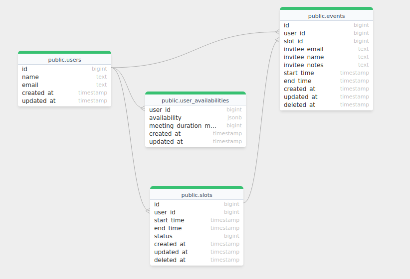

## Solution

The code presented in this repository contains the following features:

* Registering new user
* Setting user's availability
* Getting user's availability
* Finding overlap between 2 users' availabilities
* Creating slots for a user
* Viewing all slots for a user
* Deleting a given slot for a user
* Creating a new event
* Viewing all events for a user

A high level Entity Relation diagram looks like below:



### Assumptions

During the development of this system, certain assumptions were taken to help with deciding the features. They are listed below:

* Only a single event type is supported. This means that user can create only one type of event with a defined duration of the meeting.
* The person booking the event may or may not be a user of the platform.
* The system needs to support only a single timezone.

### Hacks / Known Issues

Due to a defined timeline, certain things were hacked around or were not developed with the best possible approach. Some of them are:

* Slots need to be created manually. An API is provided for the same. This can be automated using a cron job.
* The logs produced by the system are not structured.
* The error messages returned by the APIs are not masked some times and may report messages directly from the database, in some cases.
* Some corner unit test cases are skipped. A couple of APIs don't have any unit tests.

### Running the code

The code can be easily run using docker-compose. Following are some steps:

* Clone the code
* `cd` into the directory and run

```docker-compose up --build```

The code will compile and auto migrate the database

(There is a possibility of a race condition happening where the code runs before the DB is ready to accept connections. If this happens, simply cancel and re-execute the command)

* Once the code is up and running, visit `http://localhost:8080/swagger/index.html` to view the swagger docs and accessing the different APIs.

* Run tests by running

```go test ./...```

from the root directory